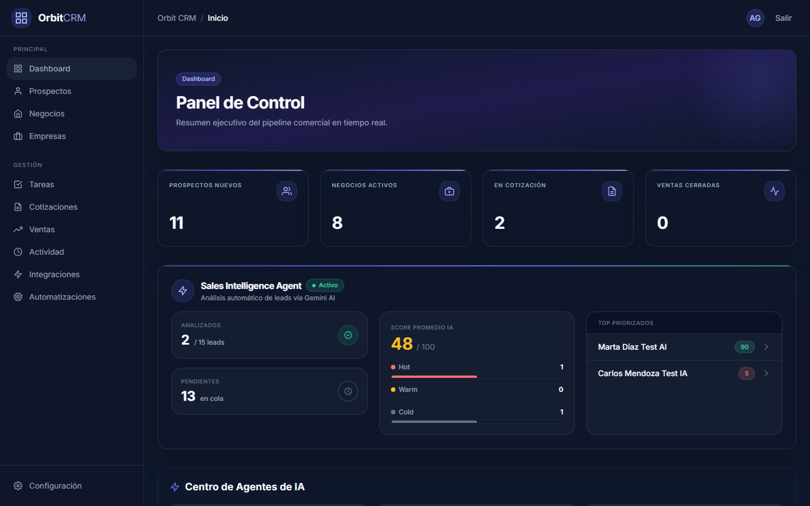
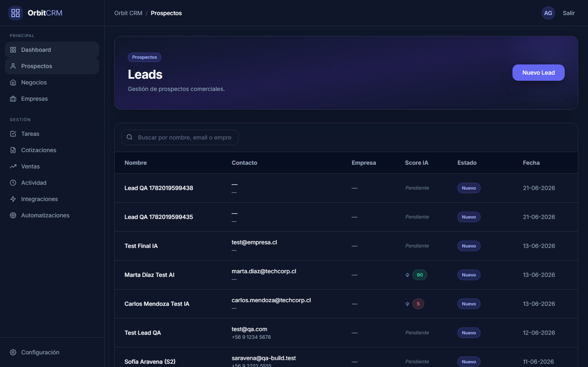
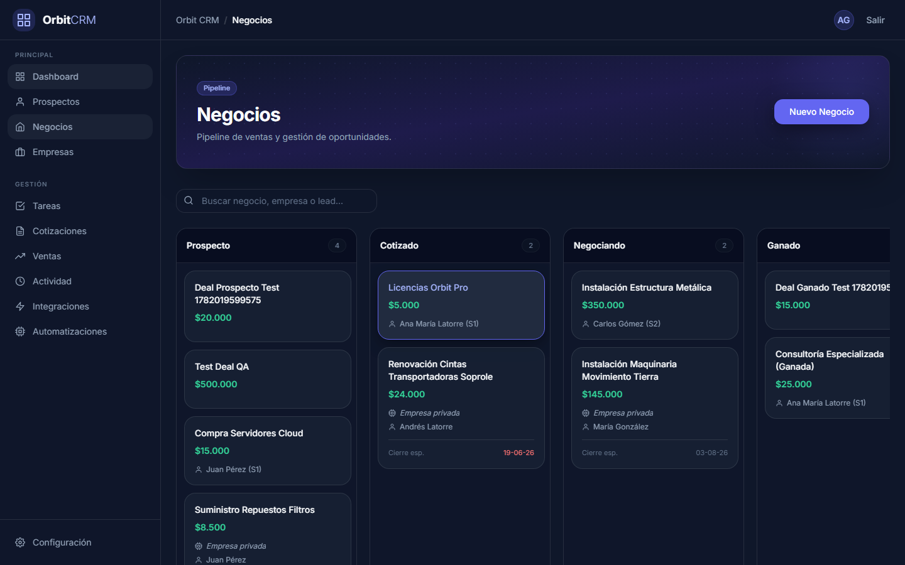
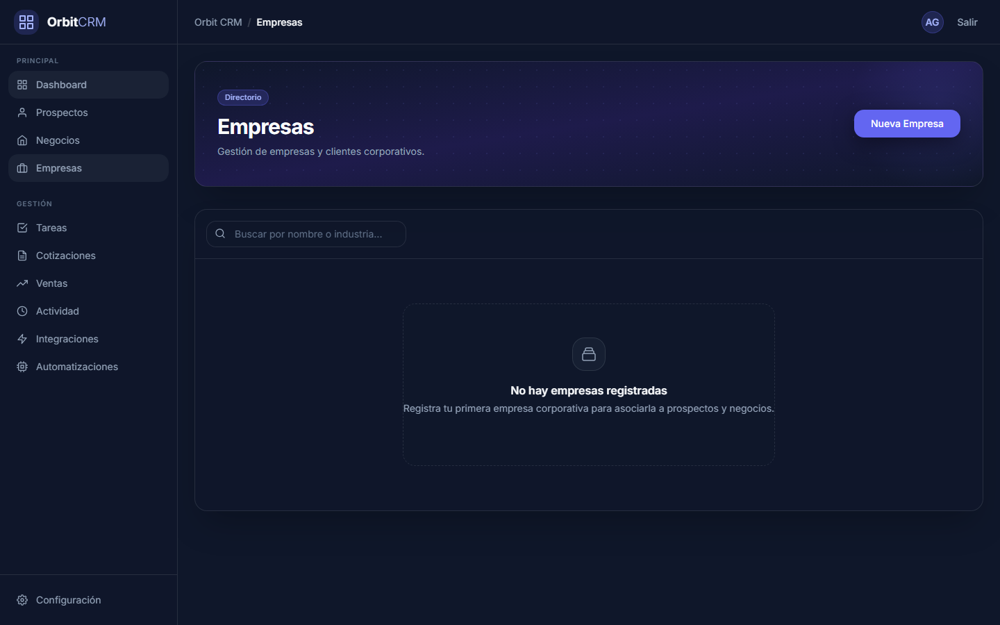
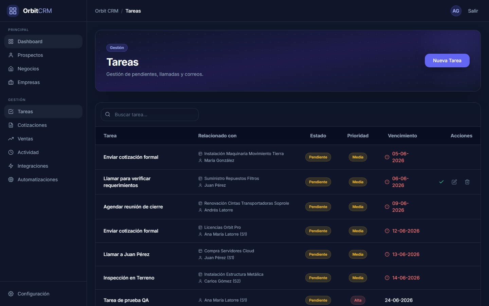
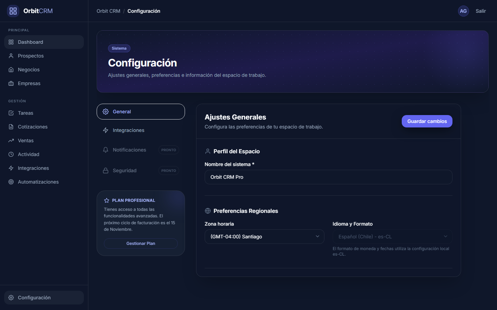

<div align="center">
  
  
  <h1>Orbit CRM</h1>
  
  <p><strong>AI-Powered CRM for Sales Teams</strong></p>
  
  <p>
    Built for scale, speed, and intelligence. Orbit CRM integrates Google's Gemini 2.0 Flash and n8n to automate lead qualification, calculate deal risks, generate weekly executive summaries, and empower sales teams with a real-time activity feed.
  </p>

  <div>
    
    
    
    
    
    
  </div>
</div>

---

## 🌟 Key Features

### 🤖 Autonomous AI Agent Suite (n8n + Gemini)
Three production-grade AI Agents operate autonomously in the background, each with full observability via `automation_logs`:

- **Lead Qualifier Agent:** Scores every incoming webhook lead (0–100), categorizes as Hot/Warm/Cold, and suggests next actions using Chain-of-Thought reasoning. Includes input validation to protect Gemini API quota.
- **Deal Risk Agent:** Runs nightly via cron, loops over every active deal using `SplitInBatches`, and applies a Chain-of-Thought prompt to assess stagnation, overdue tasks, and inactivity. Logs individual success/failure per deal iteration.
- **Weekly Summary Agent:** Every Monday at 08:00, aggregates KPIs from Supabase (new leads, won deals, high-risk deals, critical tasks), generates a formatted executive report with Gemini, and publishes it to the Activity Feed.

### 🌐 Perpetual Webhook Tunnel (ngrok Static Domain)
ngrok runs as a native Docker sibling service (`orbit_ngrok`), sharing an internal bridge network with n8n. The static free domain makes webhook URLs permanent — no reconfiguration needed across restarts.

### ⚡ Real-Time Activity Feed
Powered by Supabase `postgres_changes`, the Activity Center provides an instant, zero-polling timeline of all team interactions, deal changes, and AI insights. Hot leads (score ≥ 70) trigger toast notifications automatically.

### 🔐 Enterprise-Grade Security
- **Strict RBAC:** Admin and Seller isolation at the database level using Supabase Row Level Security (RLS).
- **Service Isolation:** AI prompts and sensitive mutations run inside the Dockerized n8n network using `service_role` keys — the frontend never touches backend secrets.
- **Zero-Secret Commits:** `.env` and `.env.n8n` are git-ignored. ngrok authtoken lives exclusively in `.env.n8n`.

### 🎨 Premium Dark Mode Design System
- **Glassmorphism UI:** Custom dark mode design system with Tailwind CSS semantic color tokens.
- **Fluid Animations:** GSAP 3 powers every transition — feed rows, metric counters, modal entrances.

---

## 📸 Platform Walkthrough

### 1. Unified Sales Dashboard
High-level view of your pipeline, revenue metrics, and active opportunities.


### 2. Intelligent Lead Management
Leads are scored autonomously by the Lead Qualifier Agent. AI badges show Hot/Warm/Cold priority in real time.


### 3. Deal Pipeline & Risk Assessment
Full pipeline tracking with AI risk scores injected nightly by the Deal Risk Agent.


### 4. Company & Account Tracking
Unified view of customer organizations linked to their deals, tasks, and activities.


### 5. Task Management
Never miss a follow-up. Tasks are tied directly to leads and deals with priority levels.


### 6. Automation Center
Admin-only hub to monitor all three AI agents, check execution health, and review `automation_logs` entries.


### 7. Settings & Configuration
Complete control over user profiles, webhook endpoints, and AI provider credentials.


---

## 🏗️ Technology Stack

| Layer | Technologies |
|-------|-------------|
| **Frontend** | Vue 3 (Composition API), Vite 5, Vue Router 4 |
| **Styling** | Tailwind CSS 3, Custom CSS Variables |
| **Animations** | GSAP 3 |
| **Backend / Database** | Supabase (PostgreSQL, Auth, Realtime) |
| **Automation / Orchestration** | n8n 1.72.0 (Self-hosted Docker) |
| **AI Models** | Google Gemini 2.0 Flash |
| **Tunnel** | ngrok Static Domain (Docker service) |

---

## 🚀 Quick Start

### 1. Clone the repository
```bash
git clone https://github.com/bayroon10/ORBIT-CRM-AGENTS.git
cd ORBIT-CRM-AGENTS
```

### 2. Install dependencies
```bash
npm install
```

### 3. Configure environment variables
```bash
cp .env.example .env
cp .env.n8n.example .env.n8n
```

Fill out `.env` with your Supabase credentials:
```env
VITE_SUPABASE_URL=https://<YOUR_PROJECT>.supabase.co
VITE_SUPABASE_ANON_KEY=<YOUR_ANON_KEY>
VITE_N8N_WEBHOOK_URL=https://<YOUR_NGROK_DOMAIN>/webhook/lead-qualifier
VITE_N8N_WEBHOOK_SECRET=your_secure_secret_here
```

Fill out `.env.n8n` with your ngrok credentials:
```env
NGROK_DOMAIN=your-static-domain.ngrok-free.app
NGROK_AUTHTOKEN=your_ngrok_authtoken
WEBHOOK_URL=https://your-static-domain.ngrok-free.app
N8N_WEBHOOK_URL=https://your-static-domain.ngrok-free.app
```

### 4. Start the full stack
```bash
# Start n8n + ngrok tunnel (Docker)
docker-compose up -d

# Start Vue frontend (port 5173)
npm run dev
```

### 5. Import AI agent workflows
```bash
docker cp n8n/workflows/lead-qualifier.json orbit_n8n:/home/node/lq.json
docker exec -u node orbit_n8n n8n import:workflow --input=/home/node/lq.json

docker cp n8n/workflows/deal-risk.json orbit_n8n:/home/node/dr.json
docker exec -u node orbit_n8n n8n import:workflow --input=/home/node/dr.json

docker cp n8n/workflows/weekly-summary-agent-optimized.json orbit_n8n:/home/node/ws.json
docker exec -u node orbit_n8n n8n import:workflow --input=/home/node/ws.json
```

Then open `http://localhost:5678`, configure the Supabase and Gemini credentials, and activate each workflow.

---

## 📚 Documentation

- [Architecture & Data Model](./ARCHITECTURE.md)
- [Agent Specifications](./AGENTS.md)
- [n8n Workflow Skills & Rules](./SKILL_N8N.md)
- [Webhook Setup](./WEBHOOK_SETUP.md)
- [Changelog](./CHANGELOG.md)
- [Contributing Guidelines](./CONTRIBUTING.md)

---

## 📄 License

This project is licensed under the MIT License. See the [LICENSE](LICENSE) file for details.
