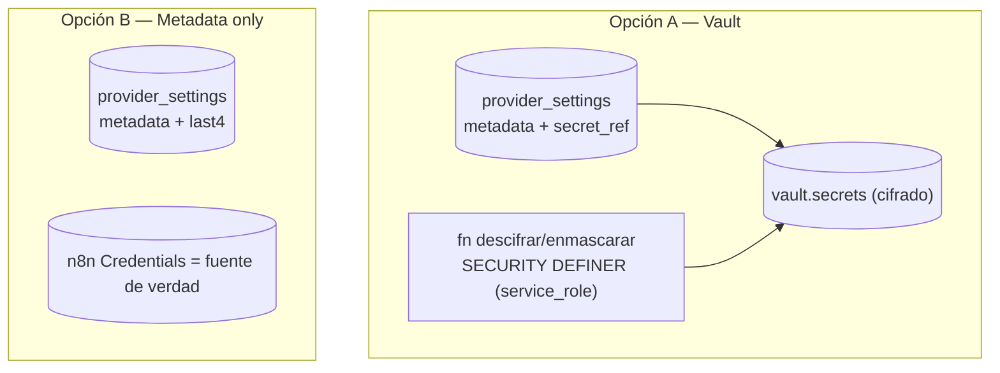

# RFC-0001 — Provider Settings Redesign (Credential Storage)

> **Estado:** Propuesto · **Fecha:** 2026-06-29 · **Autor:** Principal Engineer (revisión técnica)
> **Tarea:** T-SEC-01 · **Hallazgo:** SEC-01 (P0/Crítico) · **Nivel de cambio:** N3 (seguridad + esquema)
> **Modo:** READ ONLY — este RFC es documentación. No se modificó código, BD, ni se crearon migraciones/commits.
> **Insumo:** Engineering Design Review de T-SEC-01 (fases 1–4) y `docs/reports/*`, `docs/knowledge/*`.

---

## 0. Architecture Review Board (auto-desafío previo)

Antes de recomendar, se cuestiona la propia propuesta.

### 0.1 Desafío a la recomendación
La recomendación preliminar fue **Opción B (metadata-only)**, basada en que **ningún workflow de n8n lee `provider_settings`** (grep `provider_settings` en `**/*.json` → 0 coincidencias). Pero esa evidencia describe el **estado actual**, no la intención de diseño. La UI de OrbitCRM (`ProviderSettingsView.vue`) está construida como un **gestor de credenciales de proveedores** (OpenAI, Gemini, Claude, WhatsApp, n8n, "Otro"). Si la intención de producto es que la app sea la **fuente de verdad** de credenciales y las distribuya a sus consumidores, entonces "no almacenar el secreto" (B) **contradice el propósito del módulo** y lo convierte en un formulario decorativo.

### 0.2 Por qué la opción elegida podría estar equivocada
- **B asume** que n8n seguirá siendo el único consumidor de secretos. Si mañana el frontend o una Edge Function necesita usar una API key gestionada en la app (p. ej. enviar emails vía Resend desde una función), B obliga a re-introducir almacenamiento de secretos → retrabajo.
- **B reduce la funcionalidad** percibida: el usuario "guarda" una credencial que no se usa para nada operativo. Es honesto, pero puede sorprender.

### 0.3 Escenarios futuros donde la opción rechazada (A, Vault) sería mejor
- La app necesita **descifrar y usar** el secreto desde una Edge Function (`service_role`) para llamar a un proveedor sin pasar por n8n.
- Se quiere un **catálogo centralizado de credenciales** versionado/rotable dentro de Supabase, auditable, independiente de n8n.
- Multi-tenant (T-ARC-01): cada tenant gestiona sus propias keys y la app debe inyectarlas en runtime.

### 0.4 Supuestos
1. La tabla está **vacía** hoy (`rows: 0`) — verificado.
2. n8n gestiona los secretos operativos reales en su propio almacén — verificado (referencias `$credentials.*`).
3. El módulo Provider Settings es admin-only y de bajo volumen.
4. `supabase_vault` está instalado y disponible — verificado (`list_extensions`).

### 0.5 Incógnitas (unknowns)
- **Intención de producto:** ¿la app debe ser fuente de verdad de credenciales o solo un panel informativo? **[NO VERIFICADO]**
- ¿Habrá consumidores futuros del secreto fuera de n8n (Edge Functions, frontend)? **[NO VERIFICADO]**
- Estado del roadmap multi-tenant (T-ARC-01) que podría exigir Vault. **[NO VERIFICADO]**

### 0.6 Deuda técnica introducida por cada opción
- **Opción A (Vault):** complejidad operativa (gestión de `vault.secrets`, función de descifrado `service_role`, sincronización metadata↔secreto); más superficie a mantener y auditar.
- **Opción B (metadata-only):** "doble fuente" implícita (la app muestra metadata pero el secreto vive en n8n) → riesgo de desincronización conceptual y de UX confusa; si se necesita el secreto en la app, deuda de re-arquitectura.

### 0.7 ¿Es reversible esta decisión?
**Sí, altamente reversible hoy.** Con `rows: 0` no hay datos que migrar ni perder. Pasar de B→A o A→B en el futuro implica un cambio de esquema acotado, no una migración masiva de datos. La reversibilidad disminuirá a medida que la tabla se pueble.

### 0.8 Nivel de confianza
**Confianza en la recomendación: 72%.** Alta en la parte técnica (eliminar texto plano es obligatorio e inequívoco); moderada en la elección A vs B, porque depende de una **intención de producto no verificada**. Por eso el RFC propone B con una **vía de migración barata a A** y deja la decisión final al Approval Section.

---

## 1. Executive Summary

`provider_settings.credential_value` almacena credenciales de terceros en **texto plano**, mientras la UI promete que "la clave se cifrará al guardar". Es un hallazgo **P0/Crítico** (SEC-01). La tabla está **vacía**, lo que ofrece una ventana ideal para corregir sin migración de datos. Este RFC evalúa dos rediseños — **A: Vault (cifrado en reposo)** y **B: metadata-only (el secreto vive en n8n)** — y recomienda **B como destino**, con A como puente si surge la necesidad de que la app holdee secretos. Ambas eliminan el texto plano y la fuga de lectura.

## 2. Problem Statement

- **Qué:** secretos (Access Token de Meta/WhatsApp, API keys de IA) se guardan en claro en `provider_settings.credential_value` (`text`).
- **Por qué importa:** exposición ante dump/backup/bypass RLS/`service_role`; además, `whatsapp.service.getWhatsAppCredential()` hace `select('*')` y **devuelve el secreto completo al navegador**. La UI afirma un cifrado inexistente (riesgo de confianza/legal).
- **Evidencia:** `migrations/001_add_get_masked_credential.sql` (lee valor plano), `whatsapp.service.js` (upsert/select plano), `ProviderSettingsView.vue` (copy falso), `list_tables` (`credential_value text`, `rows: 0`).

## 3. Current Architecture

```mermaid
flowchart TB
  subgraph FE["Frontend (anon key)"]
    PSV["ProviderSettingsView.vue"]
    WSS["whatsapp.service.js"]
  end
  subgraph DB["Supabase"]
    PS[("provider_settings\ncredential_value TEXT plano")]
    RPC["get_masked_credential() SECURITY DEFINER"]
  end
  PSV -->|insert/delete| PS
  PSV -->|rpc masked| RPC --> PS
  WSS -->|select * (fuga)| PS
  WSS -->|upsert| PS
  N8N["n8n workflows"] -. NO lee .-> PS
  N8N --> NC[("n8n Credentials (secreto real)")]
```

- Consumidores de escritura: `ProviderSettingsView.saveProvider`, `whatsapp.service.saveWhatsAppCredential`.
- Consumidores de lectura: `get_masked_credential` (enmascarado), `whatsapp.service.getWhatsAppCredential` (`select('*')` → fuga).
- **n8n no consume la tabla** (grep 0). RLS: políticas "own" (duplicadas, DB-03).

## 4. Proposed Architecture

Eliminar el texto plano y la fuga de lectura. Dos modelos de destino:



En ambos: el frontend nunca recibe el secreto completo; la UI muestra solo metadata/enmascarado; el copy se corrige.

## 5. Option A — Vault (cifrado en reposo)

**Descripción:** el secreto se guarda en `vault.secrets` (cifrado autenticado, gestionado por Supabase); `provider_settings` guarda metadata + referencia. Descifrado solo vía `service_role` (vista `vault.decrypted_secrets`).

**Pros**
- La app puede ser **fuente de verdad** de credenciales y usarlas en runtime (Edge Functions `service_role`).
- Cifrado en reposo robusto y gestionado (sin manejar claves a mano).
- Compatible con multi-tenant futuro (T-ARC-01).

**Cons**
- Mayor complejidad: sincronización metadata↔secreto, función de descifrado controlada, más superficie a auditar.
- `supabase_vault` 0.3.1 — dependencia de una API gestionada que evoluciona.

**Risks**
- Mal uso de la función de descifrado podría reexponer el secreto (mitigable con `SECURITY DEFINER` + `REVOKE` a anon/authenticated, alinea con SEC-08).
- Round-trip cifrar/descifrar debe validarse en branch.

## 6. Option B — Metadata Only

**Descripción:** `provider_settings` deja de almacenar el secreto; guarda proveedor, etiqueta, tipo, estado y opcionalmente `last4` para mostrar. El secreto vive **solo en n8n Credentials**.

**Pros**
- **Menor superficie de ataque**: no hay secreto que cifrar ni filtrar en la app.
- Coherente con la realidad verificada (n8n es el único consumidor).
- Implementación y mantenimiento mínimos; elimina la fuga `select('*')` por diseño.

**Cons**
- La app **no puede** usar el secreto en runtime (si se necesitara, retrabajo).
- UX: el "guardar credencial" pasa a ser registro de metadata; hay que comunicarlo bien.
- "Fuente de verdad" del secreto queda fuera de la BD (en n8n).

**Risks**
- Desincronización conceptual metadata (app) ↔ secreto (n8n).
- Si el producto pretendía centralizar credenciales en la app, B no cumple esa intención.

## 7. Decision Matrix

Puntuación 1 (peor) – 5 (mejor) para OrbitCRM hoy.

| Criterio | Opción A (Vault) | Opción B (Metadata) |
|---|---|---|
| **Security** | 5 | 5 |
| **Complexity** (menor=mejor) | 2 | 5 |
| **Maintainability** | 3 | 5 |
| **Performance** | 4 | 5 |
| **Operational Cost** | 3 | 5 |
| **Developer Experience** | 3 | 4 |
| **Product fit (centralizar credenciales)** | 5 | 2 |
| **Total (7 criterios)** | **25** | **31** |

Ambas resuelven seguridad (objetivo no negociable). B gana en simplicidad/coste; A gana en *product fit* si la app debe holdear secretos.

## 8. Final Recommendation

**Recomendación: Opción B (metadata-only) como destino**, con **camino de migración barato a Opción A (Vault)** si emerge la necesidad de que la app use secretos en runtime.

**Justificación basada en evidencia (del Engineering Review):**
1. **n8n no lee `provider_settings`** (grep 0): el secreto en la BD no aporta valor operativo hoy → almacenarlo (aunque cifrado) añade superficie sin uso.
2. **Tabla vacía** (`rows: 0`): B es trivial y totalmente reversible ahora.
3. **Defensa en profundidad / mínimo privilegio** (Capa 1 de seguridad): "no almacenar el secreto" supera a "almacenarlo cifrado" en reducción de blast radius.
4. La fuga `select('*')` desaparece por diseño en B.

**Condición de cambio a A:** si el Approval Section confirma que la app debe ser fuente de verdad de credenciales o que habrá consumidores fuera de n8n, se adopta A. La confianza en esta recomendación es **72%** por depender de esa intención de producto no verificada.

## 9. Migration Strategy

- **Hoy:** `rows: 0` → **no hay migración de datos**. Es un cambio de esquema + ajuste de 2 archivos frontend + función.
- **Pasos (resumen, ver Design Review fases 4):** ADR de decisión → branch de Supabase para validar → cambio de esquema (quitar `credential_value` plano / o mover a Vault) → ajustar `get_masked_credential` → corregir `whatsapp.service.js` (quitar `select('*')`) → corregir UI/copy → verificación de seguridad (advisors) → merge + documentación.
- **Dependencia:** preferible tras/junto a **T-DB-01** (migraciones versionadas) para reproducibilidad.

## 10. Rollback Strategy

- **Reversibilidad: Alta.** Con `rows: 0`, el rollback es re-aplicar el esquema previo mediante migración de reversión, sin restauración de datos.
- Validación previa en **branch de Supabase** (no prod).
- Despliegue **coordinado** DB + frontend (mismo release) para no romper el contrato de `provider_settings`.
- Si se eligió A y falla el round-trip de cifrado: revertir a esquema previo en el branch antes del merge.

## 11. Open Questions

1. **Intención de producto:** ¿la app debe ser fuente de verdad de credenciales (→ A) o solo panel de metadata (→ B)? **[NO VERIFICADO]**
2. ¿Habrá consumidores del secreto fuera de n8n (Edge Functions/frontend) a corto plazo?
3. ¿Se valida en branch de Supabase (coste) o se acepta aplicar directo dado `rows: 0`?
4. ¿`get_masked_credential` se conserva (A) o se elimina (B)?
5. ¿Este cambio se registra como la primera migración versionada (T-DB-01) o espera a que T-DB-01 exista?

## 12. Approval Section

| Rol | Decisión requerida | Estado |
|---|---|---|
| Product Owner / Usuario | Opción A vs B (responde Open Question 1–2) | ⏳ Pendiente |
| Seguridad | Aprobar enfoque (N3) | ⏳ Pendiente |
| Ingeniería | Aprobar plan de migración/rollback | ⏳ Pendiente |
| ADR | Registrar decisión (`docs/adr/ADR-00XX-credential-storage.md`) | ⏳ Pendiente |

- **Decisión registrada:** _por completar tras aprobación._
- **Opción aprobada:** ☐ A (Vault) · ☐ B (Metadata-only) · ☐ A como puente → B.
- **Confianza del autor:** 72%.
- **Reversibilidad:** Alta (mientras `rows: 0`).

---

### Referencias
- Engineering Design Review T-SEC-01 (fases 1–4)
- `docs/reports/Security_Report.md` (SEC-01, SEC-08), `Technical_Debt.md` (TD-P0-01)
- `docs/execution/03_EXECUTION_PLAN.md` (T-SEC-01), `06_RISK_MATRIX.md`
- `docs/knowledge/03_DATABASE_MAP.md`, `04_API_MAP.md`, `06_N8N_MAP.md`
- Evidencia en vivo: Supabase `list_tables`, `list_extensions`, `pg_proc`; grep de código y workflows

> **STOP.** RFC generado. No se implementó nada. A la espera de aprobación y de la decisión sobre las Open Questions.
